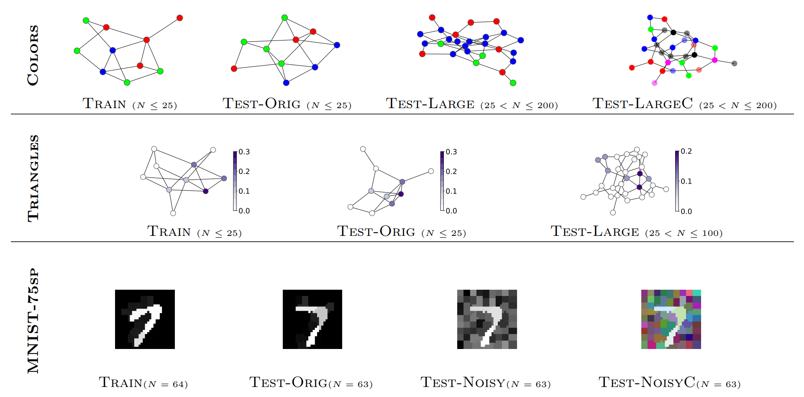

# Intro

This repository contains code to generate data and reproduce experiments from:

[Boris Knyazev, Graham W. Taylor, Mohamed R. Amer. Understanding attention in graph neural networks](https://arxiv.org/abs/1905.02850),

presented as a contributed talk at [ICLR Workshop on Representation Learning on Graphs and Manifolds, 2019](https://rlgm.github.io/cfp/).

Some cases might not be supported in our code yet. We are working on completing the code.

<figure> <figcaption>Datasets</figcaption></figure>

# Examples

To generate all data using a single command, run ```./prepare_data.sh```.

All generated/downloaded ata will be stored in the local ```./data``` directory.
It can take 1-2 hours to prepare all data.

## Data generation

### COLORS
To generate training, validation and test data for our **Colors** dataset with different dimensionalities
(in the current version of the paper ```dim```=3):

```for dim in 3 8 16 32; do python generate_data.py --dim $dim; done```

### TRIANGLES

To generate training, validation and test for our **Triangles** dataset using 2 CPU threads:

python generate_data.py -D triangles --N_train 30000 --N_val 5000 --N_test 5000 --label_min 1 --label_max 10 --N_max 100 --threads 2

### MNIST

We use standard torchvision.datasets.MNIST for MNIST.

### MNIST-75sp
To generate training and test data for our MNIST-75sp dataset using 4 CPU threads:

```for split in train test; do python extract_superpixels.py -s $split -t 4; done```

### CIFAR-10-150sp [optionally]
Our code also supports CIFAR-10, so that training and test data can be generated as following:

```for split in train test; do python extract_superpixels.py -D cifar10 -c 10 -n 150 -s $split -t 4; done```

In case of any issues with running these scripts, they can be downloaded from:


## Data visualization
Once datasets are generated or downloaded, you can use the following IPython notebooks to load and visualize data:

[COLORS and TRIANGLES](graphs_visualize.ipynb) and [MNIST-75sp and CIFAR-10-150sp](superpixels_visualize.ipynb).

## Training models

Hyperparameters should be tuned with the ```--validation``` flag.

### COLORS

To run 100 jobs with random seed for the GIN model with unsupervised attention:

```for i in $(seq 1 1 100); do seed=$(( ( RANDOM % 10000 )  + 1 )); python main.py -D colors-3 --epochs 300 --lr_decay_step 280 --test_batch_size 100 -f 64,64 -K 1 --aggregation sum --n_hidden 0 --readout sum  --dropout 0 --pool attn_unsup_threshold_skip_0.03 --pool_arch fc_prev --seed $seed --results None | tee results/colors/seed"$seed".log; done```

See [plot_results.ipynb](plot_results.ipynb) for the example how to visualize results similarly to Figures in the paper.

### TRIANGLES

### MNIST

Training a model on full size MNIST images with supervised attention:

```python main.py -D mnist --epochs 30 --lr_decay_step 20,25 --test_batch_size 200 -f 4,64,512 -K 4 --aggregation mean --n_hidden 0 --readout max --dropout 0.5 --threads 0 --img_features mean,coord --img_noise_levels 0.5,0.75 --kl_weight 100 --pool attn_sup_threshold_skip_skip_0.001 --pool_arch fc_prev``

See [mnist_wsup.sh](mnist_wsup.sh) for an example of training models with different pooling methods.

### MNIST-75sp

## Trained models

### MNIST

# Reference

Please cite our paper if you use our data or code.

```
@inproceedings{knyazev2019understanding,
  author = {Boris Knyazev and Graham Taylor and Mohamed Amer},
  title = {Understanding Attention in Graph Neural Networks},
  booktitle = {International Conference on Learning Representations (ICLR) Workshop on Representation Learning on Graphs and Manifolds},
  year = 2019,
  pdf = {http://arxiv.org/abs/1905.02850}
}
```
