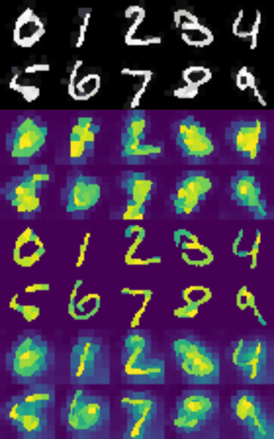

# Intro

This repository contains code to generate data and reproduce experiments from our paper:

[Boris Knyazev, Graham W. Taylor, Mohamed R. Amer. Understanding Attention and Generalization in Graph Neural Networks](https://arxiv.org/abs/1905.02850).

[An earlier short version](https://rlgm.github.io/papers/54.pdf) of our paper was presented as a contributed talk at [ICLR Workshop on Representation Learning on Graphs and Manifolds, 2019](https://rlgm.github.io/cfp/).


| MNIST |  TRIANGLES
|:-------------------------:|:-------------------------:|
| <figure> </figure> |  <figure> <figcaption></figcaption></figure> |


For MNIST from top to bottom rows:

- input test images with additive Gaussian noise with standard deviation in the range from 0 to 1.4 with step 0.2
- attention coefficients (alpha) predicted by the **unsupervised** model
- attention coefficients (alpha) predicted by the **supervised** model
- attention coefficients (alpha) predicted by our **weakly-supervised** model

For TRIANGLES from top to bottom rows:

- **on the left**: input test graph (with 4-100 nodes) with ground truth attention coefficients, **on the right**: graph obtained by **ground truth** node pooling
- **on the left**: input test graph (with 4-100 nodes) with unsupervised attention coefficients, **on the right**: graph obtained by **unsupervised** node pooling
- **on the left**: input test graph (with 4-100 nodes) with supervised attention coefficients, **on the right**: graph obtained by **supervised** node pooling
- **on the left**: input test graph (with 4-100 nodes) with weakly-supervised attention coefficients, **on the right**: graph obtained by **weakly-supervised** node pooling


Note that during training, our MNIST models have not encountered noisy images and our TRIANGLES models have not encountered graphs larger than with N=25 nodes.

## Example of evaluating the model on MNIST

For more examples, see [MNIST_eval_models](notebooks/MNIST_eval_models.ipynb) and
[TRIANGLES_eval_models](notebooks/TRIANGLES_eval_models.ipynb).

```python
# Download model checkpoint or 'git clone' this repo
import urllib.request
# Let's use the model with supervised attention (other models can be found in the Table below)
model_name = 'checkpoint_mnist-75sp_139255_epoch30_seed0000111.pth.tar'
model_url = 'https://github.com/bknyaz/graph_attention_pool/raw/master/checkpoints/%s' % model_name
model_path = 'checkpoints/%s' % model_name
urllib.request.urlretrieve(model_url, model_path)
```

```python
# Load the model
import torch
from chebygin import ChebyGIN

state = torch.load(model_path)
args = state['args']
model = ChebyGIN(in_features=5, out_features=10, filters=args.filters, K=args.filter_scale,
                 n_hidden=args.n_hidden, aggregation=args.aggregation, dropout=args.dropout,
                 readout=args.readout, pool=args.pool, pool_arch=args.pool_arch)
model.load_state_dict(state['state_dict'])
model = model.eval()
```

```python
# Load image using standard PyTorch Dataset
from torchvision import datasets
data = datasets.MNIST('./data', train=False, download=True)
images = (data.test_data.numpy() / 255.)
import numpy as np
img = images[0].astype(np.float32)  # 28x28 MNIST image
```

```python
# Extract superpixels and create node features
import scipy.ndimage
from skimage.segmentation import slic
from scipy.spatial.distance import cdist

# The number (n_segments) of superpixels returned by SLIC is usually smaller than requested, so we request more
superpixels = slic(img, n_segments=95, compactness=0.25, multichannel=False)
sp_indices = np.unique(superpixels)
n_sp = len(sp_indices)  # should be 74 with these parameters of slic

sp_intensity = np.zeros((n_sp, 1), np.float32)
sp_coord = np.zeros((n_sp, 2), np.float32)  # row, col
for seg in sp_indices:
    mask = superpixels == seg
    sp_intensity[seg] = np.mean(img[mask])
    sp_coord[seg] = np.array(scipy.ndimage.measurements.center_of_mass(mask))

# The model is invariant to the order of nodes in a graph
# We can shuffle nodes and obtain exactly the same results
ind = np.random.permutation(n_sp)
sp_coord = sp_coord[ind]
sp_intensity = sp_intensity[ind]
```

```python
# Create edges between nodes in the form of adjacency matrix
sp_coord = sp_coord / images.shape[1]
dist = cdist(sp_coord, sp_coord)  # distance between all pairs of nodes
sigma = 0.1 * np.pi  # width of a Guassian
A = np.exp(- dist / sigma ** 2)  # transform distance to spatial closeness
A[np.diag_indices_from(A)] = 0  # remove self-loops
A = torch.from_numpy(A).float().unsqueeze(0)
```

```python
# Prepare an input to the model and process it
N_nodes = sp_intensity.shape[0]
mask = torch.ones(1, N_nodes, dtype=torch.uint8)

# mean and std computed for superpixel features in the training set
mn = torch.tensor([0.11225057, 0.11225057, 0.11225057, 0.44206527, 0.43950436]).view(1, 1, -1)
sd = torch.tensor([0.2721889,  0.2721889,  0.2721889,  0.2987583,  0.30080357]).view(1, 1, -1)

node_features = (torch.from_numpy(np.pad(np.concatenate((sp_intensity, sp_coord), axis=1),
                                         ((0, 0), (2, 0)), 'edge')).unsqueeze(0) - mn) / sd    

y, other_outputs = model([node_features, A, mask, None, {'N_nodes': torch.zeros(1, 1) + N_nodes}])
alpha = other_outputs['alpha'][0].data
```

- `y` is a vector with 10 unnormalized class scores. To get a predicted label, we can use ```torch.argmax(y)```.

- `alpha` is a vector of attention coefficients alpha for each node.

## Tasks & Datasets

1. We design two synthetic graph tasks, COLORS and TRIANGLES, in which we predict the number of green nodes and the number of triangles respectively.

2. We also experiment with the [MNIST](http://yann.lecun.com/exdb/mnist/) image classification dataset, which we preprocess by extracting superpixels - a more natural way to feed images to a graph. We denote this dataset as MNIST-75sp.

3. We validate our weakly-supervised approach on three common graph classification benchmarks: [COLLAB, PROTEINS and D&D](https://ls11-www.cs.tu-dortmund.de/staff/morris/graphkerneldatasets).

For COLORS, TRIANGLES and MNIST we know ground truth attention for nodes, which allows us to study graph neural networks with attention in depth.

<figure> <figcaption></figcaption></figure>


## Data generation

To generate all data using a single command: ```./scripts/prepare_data.sh```.

All generated/downloaded ata will be stored in the local ```./data``` directory.
It can take about 1 hour to prepare all data (see my [log](logs/prepare_data.log)) and all data take about 2 GB.

Alternatively, you can generate data for each task as described below.

In case of any issues with running these scripts, data can be downloaded from [here](https://drive.google.com/drive/folders/1Prc-n9Nr8-5z-xphdRScftKKIxU4Olzh?usp=sharing).

### COLORS
To generate training, validation and test data for our **Colors** dataset with different dimensionalities:

```for dim in 3 8 16 32; do python generate_data.py --dim $dim; done```

### MNIST-75sp
To generate training and test data for our MNIST-75sp dataset using 4 CPU threads:

```for split in train test; do python extract_superpixels.py -s $split -t 4; done```

## Data visualization
Once datasets are generated or downloaded, you can use the following IPython notebooks to load and visualize data:

[COLORS and TRIANGLES](notebooks/synthetic_graphs_visualize.ipynb), [MNIST](notebooks/superpixels_visualize.ipynb) and
[COLLAB, PROTEINS and D&D](notebooks/graphs_visualize.ipynb).


# Pretrained ChebyGIN models

Generalization results on the test sets for three tasks. Other results are available in the paper.

Click on the result to download a trained model in the PyTorch format.

| Model                 | COLORS-Test-LargeC | TRIANGLES-Test-Large | MNIST-75sp-Test-Noisy
| --------------------- |:-------------:|:-------------:|:-------------:|
| Script to train models | [colors.sh](scripts/colors.sh) | [triangles.sh](scripts/triangles.sh) | [mnist_75sp.sh](./scripts/mnist_75sp.sh) |
| Global pooling | [15 ± 7](./checkpoints/checkpoint_colors-3_828931_epoch100_seed0000111.pth.tar) | [30 ± 1](./checkpoints/checkpoint_triangles_658037_epoch100_seed0000111.pth.tar) | [80 ± 12](./checkpoints/checkpoint_mnist-75sp_820601_epoch30_seed0000111.pth.tar)  |
| Unsupervised attention | [11 ± 6](./checkpoints/checkpoint_colors-3_223919_epoch300_seed0000111.pth.tar) | [26 ± 2](./checkpoints//checkpoint_triangles_051609_epoch100_seed0000111.pth.tar)  | [80 ± 23](./checkpoints/checkpoint_mnist-75sp_330394_epoch30_seed0000111.pth.tar)  |
| Supervised attention | [75 ± 17](./checkpoints/checkpoint_colors-3_332172_epoch300_seed0000111.pth.tar) | [48 ± 1](./checkpoints/checkpoint_triangles_586710_epoch100_seed0000111.pth.tar) | [92.3 ± 0.4](./checkpoints/checkpoint_mnist-75sp_139255_epoch30_seed0000111.pth.tar) |
| Weakly-supervised attention | [73 ± 14 ](./checkpoints//checkpoint_colors-3_312570_epoch300_seed0000111.pth.tar) | [30 ± 1](./checkpoints/checkpoint_triangles_230187_epoch100_seed0000111.pth.tar)  | [88.8 ± 4](./checkpoints/checkpoint_mnist-75sp_065802_epoch30_seed0000111.pth.tar) | |


The scripts to train the models must be run from the main directory, e.g.: ```./scripts/mnist_75sp.sh```

Examples of evaluating our trained models can be found in notebooks: [MNIST_eval_models](notebooks/MNIST_eval_models.ipynb) and
[TRIANGLES_eval_models](notebooks/TRIANGLES_eval_models.ipynb).


## Other examples of training models

To tune hyperparameters on the validation set for COLORS, TRIANGLES and MNIST, use the ```--validation``` flag.

For COLLAB, PROTEINS and D&D tuning of hyperparameters is included in the training script.

Example of running 10 weakly-supervised experiments on PROTEINS with cross-validation of hyperparameters:

```for i in $(seq 1 1 10); do seed=$(( ( RANDOM % 10000 )  + 1 )); python main.py --seed $seed -D TU --n_nodes 25 --epochs 50 --lr_decay_step 25,35,45 --test_batch_size 100 -f 64,64,64 -K 3 --aggregation mean --n_hidden 0 --readout max --dropout 0.1 --pool attn_sup_threshold_skip_skip_0 --pool_arch fc_prev --results ./checkpoints --data_dir ./data/PROTEINS | tee logs/proteins_wsup_seed"$seed".log; done```


# Reference

Please cite our paper if you use our data or code.

```
@inproceedings{knyazev2019understanding,
  author = {Boris Knyazev and Graham Taylor and Mohamed Amer},
  title = {Understanding Attention and Generalization in Graph Neural Networks},
  booktitle = {International Conference on Learning Representations (ICLR) Workshop on Representation Learning on Graphs and Manifolds},
  year = 2019,
  pdf = {http://arxiv.org/abs/1905.02850}
}
```
